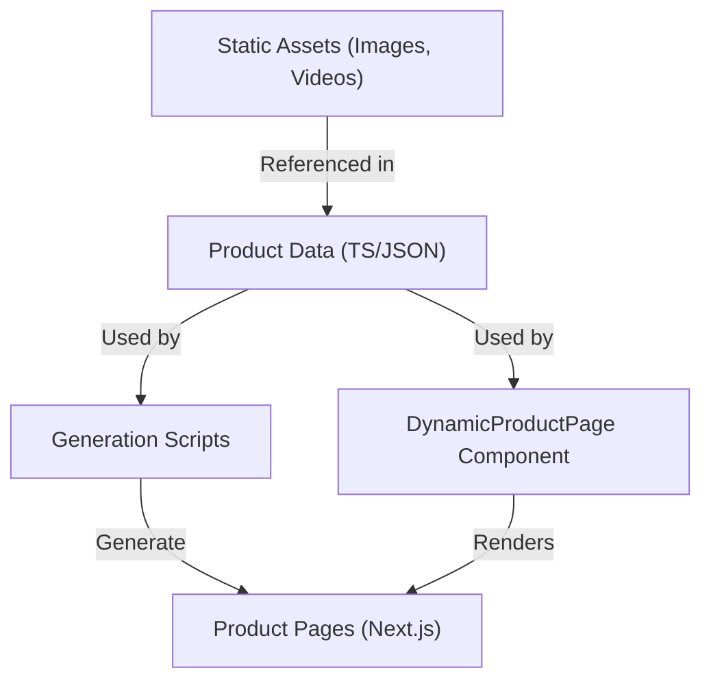

# Mel Systems Website – Project Overview

## What is this project?

This project is the codebase for the **Mel Systems** website, a product and solutions showcase for industrial monitoring, oil conditioning, and safety systems. The site presents a large catalog of products (sensors, gateways, control panels, etc.) and their applications across various industries (renewable energy, transport, industrial, agricultural, and more).

---

## How does it work?

### 1. Product Page Generation System
- The core of the project is a **dynamic product page generation system**.
- Product pages are generated automatically from structured data, ensuring consistency and scalability.
- Scripts are provided to generate single or multiple product pages from JSON data, making it easy to add or update products.

### 2. Main Components
- **DynamicProductPage**: Universal React component that renders any product page based on provided data.
- **ProductData Interface**: Defines the structure for all product information (name, images, description, features, specs, etc.).
- **products.ts**: Central file where all product data is stored.
- **Generation Scripts**: Located in `scripts/`, these automate the creation of product pages from data files.

### 3. File Structure
- `src/components/`: Reusable React components, including the dynamic product page template.
- `src/lib/`: Data files (like `products.ts`) and utility functions.
- `src/app/`: Next.js route handlers and page components for each product, application, etc.
- `public/`: Static assets (images, videos, etc.) used on the site.
- `scripts/`: Node.js scripts for generating product pages.

### 4. Data-Driven Design
- All product information is stored as structured data (TypeScript objects or JSON).
- The site can be updated or expanded by simply adding new data, not by writing new code for each product.

### 5. Technologies Used
- **Next.js**: Server-side rendering, routing, and static site generation.
- **React**: UI components.
- **TypeScript**: Type safety and maintainability.
- **Tailwind CSS**: Styling.
- **Radix UI, Framer Motion, GSAP**: UI components and animations.

### 6. Customization and Extensibility
- The product page template can be customized by editing `DynamicProductPage.tsx`.
- New fields or sections can be added by updating the data interface and the template.
- The system is designed to be scalable, allowing for rapid addition of new products and categories.

---

## What does the site offer?

- **Product Catalog**: Detailed pages for each product, including images, descriptions, features, and technical specs.
- **Applications**: Real-world use cases and solutions for different industries.
- **Company Info**: About Us, Why Choose Us, and impact statistics.
- **Automated Content Management**: Easy to add/update products via scripts and data files.

---

## Summary Diagram

---

## In Short

- **Mel Systems** is a data-driven, scalable product catalog and solutions website.
- It uses automated scripts and a universal template to generate consistent, rich product pages from structured data.
- The design allows for rapid expansion and easy maintenance, with a focus on industrial and safety solutions.

---

# Product Structure

## Oil Conditioning

    - TanDelta
        - OQSx-G2 Oil Quality Sensor
        - OQSx-G2 HAZ Oil Quality Sensor
        - MOT – Mobile Oil Test Kit
        - *OQSX-G2 Sensor kit*
        - SENSE2 Display Kit
        - SENSE3 Gateway Kit
        - Gateway (OQTg)
        - OQDe-G2 Display Express
        - Gateway Hub
        - Manifold
        - Cables
            - Cable J
            - Cable X
            - Cable M
            - Cable HP
            - Cable BBHaz
            - Cable BBSt
            - Cable DB
            - Cable HB
            - Cable GH
            - Cable SD
            - Cable SB
            - Cable SH
            - Cable HH
            - Cable HCP-1
    - Hydrotechnik
        - Watchlog USB
            - Watchlog USB Dual Pressure and Temperature Sensor
            - Watchlog USB Windows® PC/tablet pressure & temperature measurement software
        - Watchlog Bluetooth Sensors, Gauges and Mobile Apps
            - Watchlog Bluetooth Pressure & Temperature Sensors, Gauges and App for up to 4 sensors connected simultaneously
                - WLB-PT Compact Bluetooth Pressure Sensor
                - WLB-TT Compact Bluetooth Temperature Sensor
                - WLB-DDPG Series Bluetooth Digital Datalogging Pressure Gauges
                - WLB-DPG Series Watchlog Bluetooth Digital Pressure Gauge
                - Watchlog Bluetooth Live View & Datalogging App for iOS and Android
                - DDPG Series Digital Datalogging Bluetooth Pressure Gauge & Minimess® Test Kit
                - DPG Series Digital Bluetooth Pressure Gauge & Minimess® Test Kit
            - Watchlog Bluetooth-Plus Pressure, Level & Force Sensors and App for up to 12 connected sensors & advanced app calculation features
                - HT-WLBP Watchlog Bluetooth-Plus Pressure Sensor
                - HT-WLBL Watchlog Bluetooth-Plus Hydrostatic Level Sensors
                - HT-WLBLC Watchlog Bluetooth-Plus Compression Load Cells
                - HT-WLBLL Watchlog Bluetooth-Plus Compression Load Link
                - Watchlog Bluetooth-Plus iOS and Android App
        - Watchlog Wireless Pressure, Temperature and Flow Sensors
            - Watchlog Wireless Pressure, Flow & Temperature Test Kit
            - Watchlog Wireless Vision
            - Watchlog ATEX Wireless Pressure Sensors
            - Watchlog Wireless Pressure Sensors
            - Watchlog Wireless Temperature Sensors
            - Watchlog Wireless Linear Position Sensor
            - Watchlog Wireless Turbine Flow Meters
            - Watchlog Wireless Oval Gear Flow Meters
            - Watchlog Wireless USB Base Stations / Receivers
            - WLW-AR Wireless Signal Extender
            - Watchlog Wireless Signal Gateway Modules
            - Watchlog Wireless Configuring, Monitoring & Logging Software
            - Watchlog Wireless Accessories
            - WLWPL Series Cellular Level Sensor
        - Watchlog Pro Remote Monitoring
            - Watchlog PRO ORB Cellular / Wi-Fi Cloud Gateway for Mobile Applications
            - Watchlog PRO QUAD Cellular / Wi-Fi Cloud Gateway for Fixed Systems
            - Watchlog Pro Hydraulic System Monitoring
            - Watchlog PRO Custom Cloud Monitoring
        - Watchlog CSV Visualizer Software
    - Filtertechnik
        - S120 Digital Imaging Particle Counter
        - Particle Pal
            - FS9V2 - Particle Pal - Laser Portable Particle Counter
            - FS9V2-RH - Particle Pal + Water Sensor - Laser Portable Particle Counter
            - FS9V2-RH-DEN - Particle Pal + Water & Density Sensor - Laser Portable Particle Counter
            - FS9-OLO - Remaining Oil Life Portable Test Kit
            - FS9V3 - Particle Pal Pro - Digital Imaging Portable Particle Counter
            - FS9V3-RH - Particle Pal Pro + Water Sensor - Digital Imaging Portable Particle Counter
            - FS9V3-OLU - Particle Pal Pro: Life - Digital Imaging Portable Particle Counter: Including water and remaining oil life sensor
            - FS9V3-OLU-VISCO - Particle Pal Pro + Viscosity - Digital Imaging Portable Particle Counter
            - FS9V4-RH - Particle Pal Plus + Water RH%: Digital Imaging Portable Particle Counter
            - FS9V4-PPM - Particle Pal Plus + Water PPM: Digital Imaging Portable Particle Counter
            - FS9V4 - Particle Pal Plus: Digital Imaging Portable Particle Counter
            - FS9V4-HV - Particle Pal Plus High Viscosity: Digital Imaging Portable Particle Counter
            - FS9V4-PPM-DEN - Particle Pal Plus + Water PPM and Density Sensor: Digital Imaging Portable Particle Counter
            - FS9V4-RH-HV - Particle Pal Plus High Viscosity + Water RH%: Digital Imaging Portable Particle Counter
            - FS9V4-RH-V-D-HV - Particle Pal Plus High Viscosity: Particulate, Water RH%, Viscosity and Density
    - Evamo
        - Evamo - Smart Bubble System

## Systems

    - Motec
        - Rear View Cameras
            - MC3000B - Heavy-Duty Camera
            - MC3000B-VA - Heavy-duty stainless steel-camera
            - MC3000C-IR & WL - Night vision-compatible heavy-duty infrared camera with built-in light
            - MC4000A - Heavy-duty camera
            - MC4000A-IR & WL - Night-vision-compatible heavy-duty infrared camera with built-in light
            - MC6000D - Sturdy universal camera
            - MC7000C Series - Heavy Duty Camera
            - MC7180N - Wide-angle camera
            - MC7000B-MH1 - Heavy Duty Camera
            - MC7000B-MH2 Heavy Duty Camera
        - Front Camera System
            - MC3050B-4-VKMS - Heavy Duty Camera for front implements
        - Digital Camera's
            - MCDB7000A - Heavy Duty Broadr-Reach Camera
            - MCDE3000 - OEM Ethernet Camera
            - MCDL7000A - Heavy-Duty LVDS Camera
            - MCDE7000A - Heavy-Duty Ethernet Camera
            - MCDE5200 - Digital Motor Zoom Camera
        - Monitors
            - MD3071A  - 7" Monitor
            - MD3073 - Waterproof heavy-duty monitor
            - MD3100 - 10.2" Monitor
            - 17 Zoll LCD Monitor
            - MD4074-Quad-IP30 & IP67 Heavy duty monitor
        - Digital Monitors
            - MDDE1072 7" Heavy duty digital ethernet monitor
            - MDDE1102 10" heavy duty digital ethernet monitor
            - MDDE1122 12" heavy duty digital ethernet monitor
        - Fork Camera's
            - MC9000 - Sturdy fork camera
            - MC9150B - heavy duty pinhole camera
            - MC9250 - sturdy fork camera
            - MC925C - fork-arm mounted camera
        - Video Control Units
            - MVCD2000 - digital video control unit
            - MVCU1300
            - MVCU1400
            - MVCU1500
            - MVCU1600
            - MB1205 - for two cameras
            - MB1405-Quad - with split function
            - MBE5200 - for cranes
            - MV13 - video unit
            - MV5201-1
        - Crane Camera's
            - MWS - motec workview system
            - MC5201 - motor zoom camera
            - MCDE5200 - digital motor zoom camera
        - Transmissions
            - MVRD1100 - digital radio system
            - MAB2000 - mobile heavy duty battery box
            - MVR5200 - wireless system for cranes
            - MTP-VS and MTP-VE - video signal amplifier
            - MKW-Kabel
            - MK5-cabel
            - MK25.15-MA2-cable
            - Mk67-cable
            - MK84-cable
            - MK228-cabel
            - MK232-cabel
            - MK295-cabel
            - MK296-cabel

# Applications 

- chiller compressors
- concrete
- concrete delivery
- electricity transformers
- engine
- environment agency
- gearbox
- genset engine
- heavy lift cranes
- heavy mining equipment
- hydraulic
- large marine engine
- natural gas engine
- railway locomotive
- Sheffield Forgemaster's
- wind turbine gearbox
- work boat engine monitoring kit